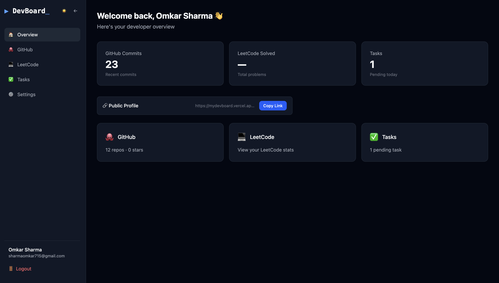
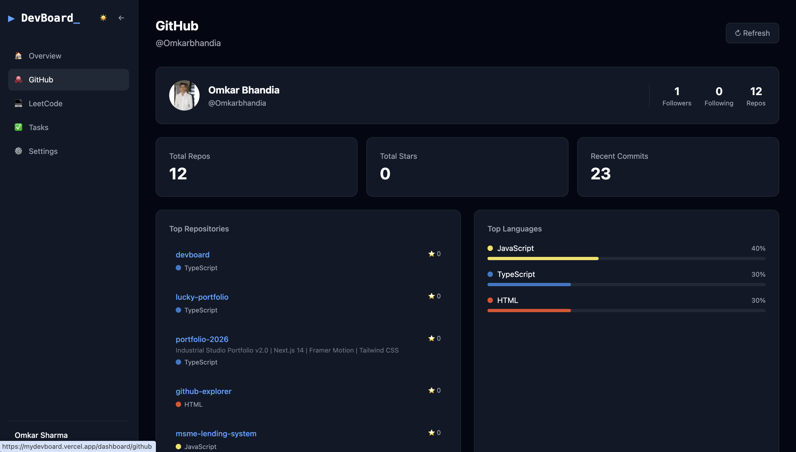
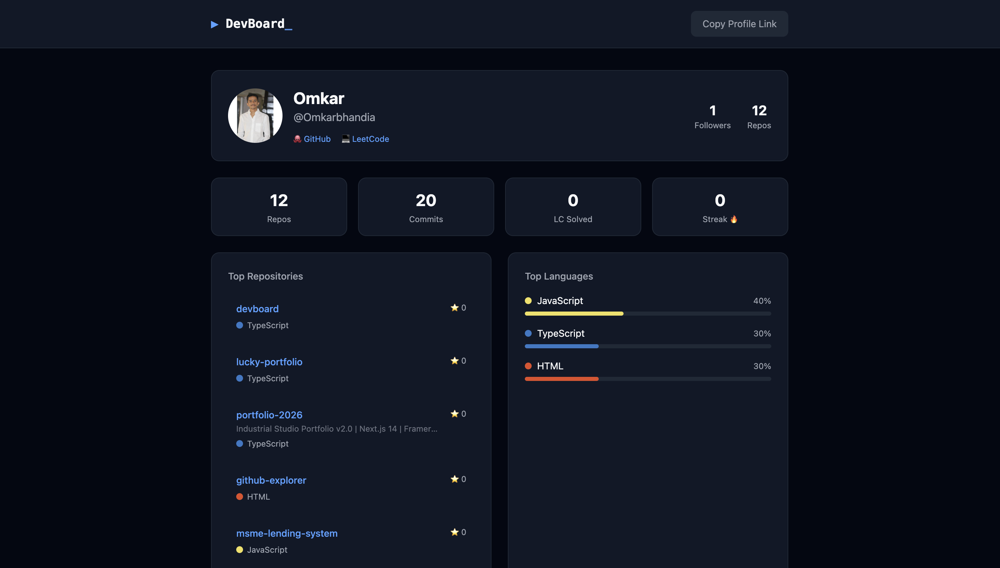

# ▶ DevBoard_

A developer productivity dashboard to track your GitHub activity, LeetCode progress, and daily tasks — all in one place.

## 🔗 Live Demo
[mydevboard.vercel.app](https://mydevboard.vercel.app)

## 📸 Screenshots
> 
> 
> 

## ✨ Features
- 🐙 **GitHub Analytics** — commits, repos, stars, top languages and contribution stats
- 💻 **LeetCode Tracker** — problems solved by difficulty, streak, global ranking
- ✅ **Task Manager** — priority-based task management with filters
- 🔗 **Public Profile** — shareable developer profile URL for your resume
- ⚙️ **Account Settings** — update name, connected accounts and password
- 🌓 **Dark/Light Mode** — persistent theme toggle
- 📱 **Fully Responsive** — works on all screen sizes

## 🛠 Tech Stack

**Frontend**
- Next.js 15 (App Router)
- TypeScript
- Tailwind CSS v4
- React Context API

**Backend**
- Node.js + Express.js
- MongoDB + Mongoose
- JWT Authentication (HTTP-only cookies)

**External APIs**
- GitHub REST API
- LeetCode GraphQL API

**Deployment**
- Vercel (frontend)
- Render (backend)
- MongoDB Atlas (database)

## 🚀 Getting Started

### Prerequisites
- Node.js 18+
- MongoDB Atlas account
- GitHub Personal Access Token

### Installation

```bash
# Clone the repo
git clone https://github.com/Omkarbhandia/devboard.git
cd devboard

# Install dependencies
npm install

# Set up environment variables
cp server/.env.example .env.local
# Fill in your values in .env.local

# Run frontend (Terminal 1)
npm run dev

# Run backend (Terminal 2)
npm run server
```

### Environment Variables

```env
MONGODB_URI=your_mongodb_connection_string
JWT_SECRET=your_jwt_secret
GITHUB_TOKEN=your_github_personal_access_token
NEXT_PUBLIC_API_URL=http://localhost:5001
NODE_ENV=development
```

## 📁 Project Structure

```
devboard/
├── app/                        # Next.js pages
│   ├── dashboard/              # Protected dashboard pages
│   │   ├── github/             # GitHub stats page
│   │   ├── leetcode/           # LeetCode stats page
│   │   ├── tasks/              # Task manager page
│   │   ├── settings/           # Account settings page
│   │   └── layout.tsx          # Shared dashboard layout
│   ├── profile/[username]/     # Public profile page
│   ├── login/                  # Login page
│   ├── register/               # Register page
│   └── context/                # React Context (auth)
├── server/                     # Express backend
│   ├── routes/                 # API routes
│   ├── models/                 # MongoDB models
│   └── middleware/             # Auth middleware
└── public/                     # Static assets
```

## 🔒 Security
- Passwords hashed with bcryptjs
- JWT stored in HTTP-only cookies
- CORS configured for production
- Input validation on all routes

## 📄 License
MIT